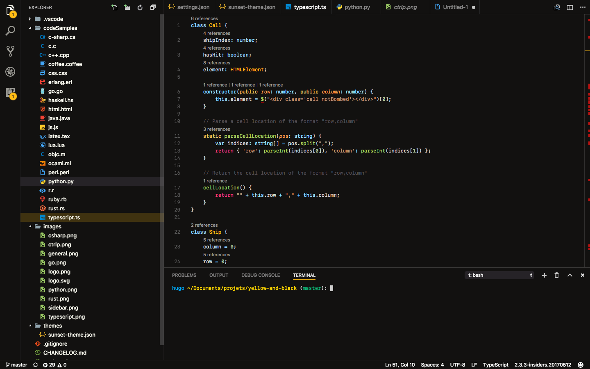
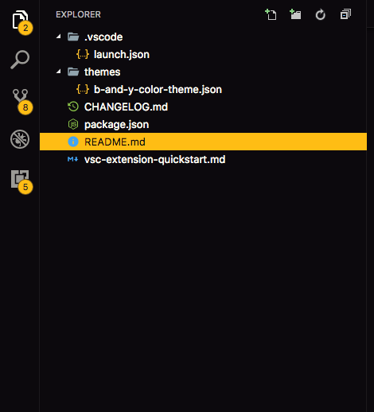
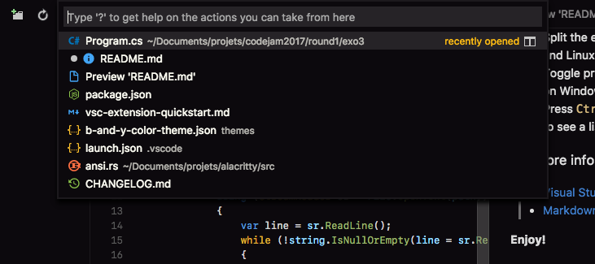

# B&Y - Black & Yellow theme

This theme provides color customization for all the main components of vscode:
* `editor`
* `peek view`
* `status bar`
* `activity bar`
* `panels`
* `etc ...`

In the following screens, I am using [Material Icons](https://marketplace.visualstudio.com/items?itemName=PKief.material-icon-theme) icon themes

[Github repository](https://github.com/Swiiip/b-and-y.git)

All comments/improvements are welcome, `enjoy` !

# Overview

# Demo

# Sidebar

# Command palette
